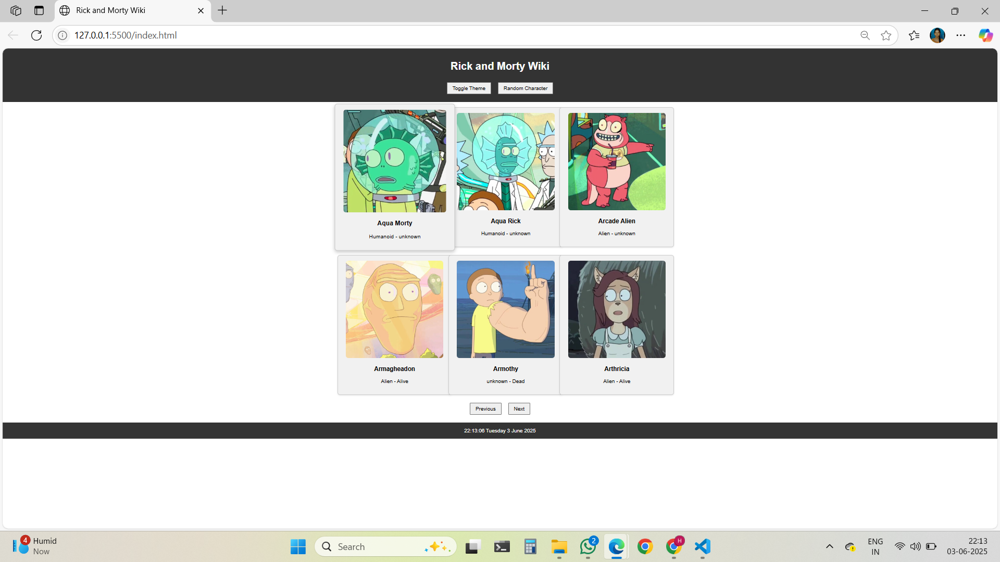
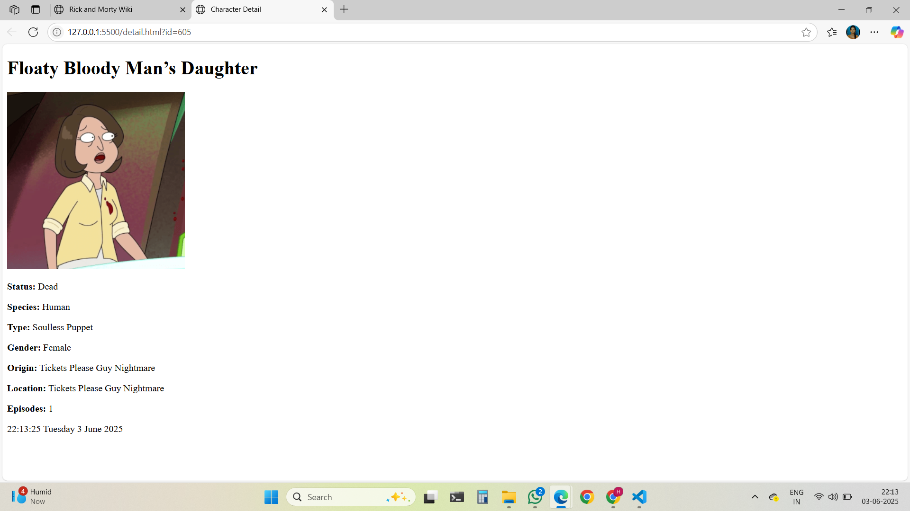
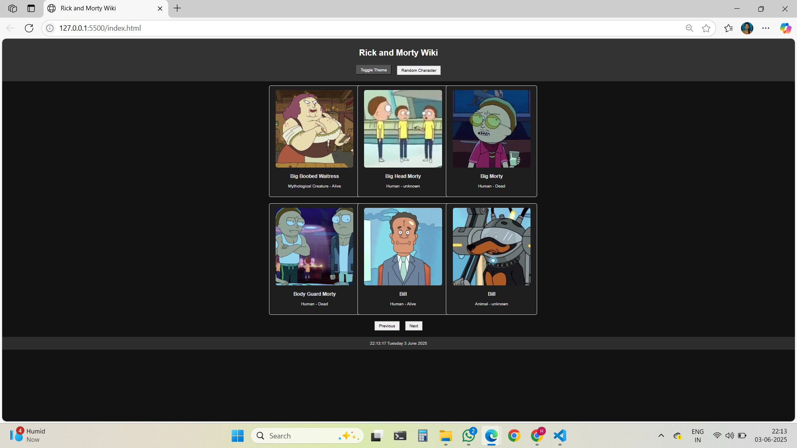

# 🧪 Rick and Morty Wiki Application

A web-based character encyclopedia powered by the [Rick and Morty API](https://rickandmortyapi.com/). Users can browse characters, view detailed information, and enjoy a live clock—all in a responsive, JavaScript-powered interface.

🌐 **[Live Demo →](https://cool-cactus-c780ad.netlify.app/)**

---

## 📌 Project Highlights

### 🖼️ Character Gallery
- Displays **6 characters per page** in a **3×2 responsive grid**.
- Fully responsive for tablets (2×3) and mobiles (1×6).

### 🔄 Pagination
- Navigate through character pages using **Next** and **Previous** buttons.
- API page tracking ensures correct boundary limits.

### 📇 Character Cards
- Each card shows: **Image**, **Name**, **Species**, and **Status** (Alive, Dead, Unknown).
- Cards are **clickable**, opening a **detailed view in a new tab**.

### 🔍 Character Detail Page
- Full-size character image.
- Detailed info: **Name, Status, Species, Type, Gender**.
- **Origin** and **Current Location**.
- Number of **Episode Appearances**.

### 🕒 Live Footer Clock
- Displays current time in format: `HH:MM:SS Day Month Date, Year`.

---

## ✨ Optional Enhancements
- 🌗 Dark/Light Mode Toggle *(optional feature)*
- 🎲 Random Character Button *(optional feature)*

---

## 📂 Table of Contents
1. [Demo](#-live-demo)
2. [Tech Stack](#-tech-stack)
3. [Setup & Installation](#-setup--installation)
4. [Screenshots](#-screenshots)
5. [Challenges Faced](#-challenges-faced)

---

## 🛠️ Tech Stack

- **Frontend**: HTML5, CSS3 (Flexbox & Grid), JavaScript (Vanilla)
- **API**: [Rick and Morty API](https://rickandmortyapi.com/)
- **Styling**: Responsive design using media queries
- **Deployment**: Netlify

---

## 🚀 Setup & Installation

### 🔧 Prerequisites
- A modern web browser (Chrome, Firefox, Edge, Safari)

### ▶️ Running the App
1. Clone or download the repository.
2. Open `index.html` in your browser.
3. That’s it! The app runs fully client-side.

---

## 📸 Screenshots

> (Add actual image links or relative paths to your `/screenshots` folder)

### 🏠 Home Page Grid  

### 📄 Character Detail View  

### ⏰ Live Clock Footer  

---

## ⚔️ Challenges Faced

1. **Asynchronous API Calls**  
   - Manually handled `fetch()` promises, loading states, error handling, and DOM updates without using any JS framework.

2. **Pagination Logic**  
   - Tracked current page using JavaScript variables and dynamically updated API queries with proper edge checks.

3. **Responsive Grid**  
   - Built a 3×2 layout using CSS Grid and made it adaptive to tablets (2×3) and mobiles (1×6) with media queries.

4. **Manual Routing**  
   - Simulated routing by passing character ID using `URLSearchParams` and extracting it in the detail page.

5. **Live Footer Clock**  
   - Created a reusable clock function using `setInterval()` and the native `Date()` object for real-time updates.

